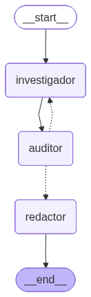
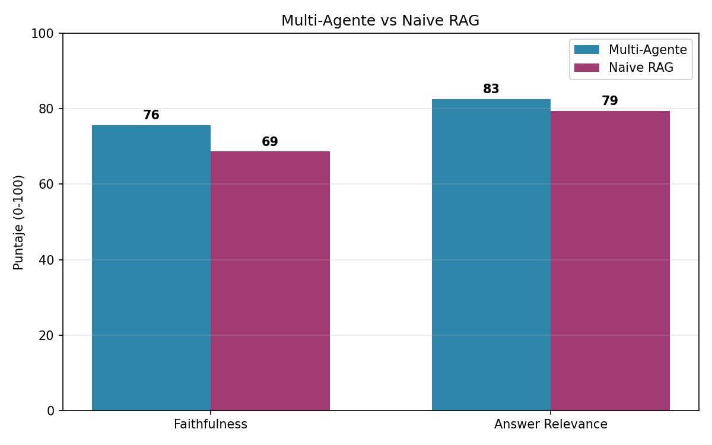

# Sistema Multi-Agente ReAct para Auditoría de Inteligencia Financiera

**Curso:** Procesamiento del Lenguaje Natural (PLN)
**Proyecto Final — Opción 2:** Sistema Operativo de Agentes Cognitivos para Inteligencia Competitiva

---

## 1. Introducción

Los sistemas de generación aumentada por recuperación (RAG) de un solo paso presentan una
limitación conocida: la respuesta se genera y se entrega sin ningún mecanismo de verificación
posterior, por lo que una alucinación del modelo llega directamente al usuario final. Este
proyecto aborda esa limitación mediante un sistema multi-agente basado en el paradigma ReAct
(Reasoning and Acting), en el que la generación de una respuesta pasa por una etapa explícita
de auditoría antes de ser entregada.

El sistema está compuesto por tres agentes con roles diferenciados:

| Agente | Función |
|---|---|
| **Investigador** | Recupera evidencia de una base vectorial (ChromaDB) y de búsqueda web (DuckDuckGo), y redacta un borrador de respuesta citando sus fuentes |
| **Auditor de Hechos** | Contrasta el borrador contra el contexto recuperado; si encuentra afirmaciones sin respaldo, lo rechaza y devuelve una razón concreta |
| **Redactor** | Convierte el borrador ya aprobado en la respuesta final entregada al usuario |

El ciclo Investigador ↔ Auditor se repite hasta que el borrador es aprobado o se alcanza un
límite de reintentos. La orquestación de este ciclo se implementa como un grafo de estados con
**LangGraph**.



## 2. Arquitectura del sistema

| Componente | Elección | Justificación |
|---|---|---|
| Modelo orquestador | Mistral-7B-Instruct-v0.3, cuantizado en 4 bits | Corre en una sola GPU sin necesidad de ajuste fino; el mismo modelo cumple los tres roles cambiando únicamente el prompt de sistema |
| Orquestación de agentes | LangGraph (`StateGraph`) | Permite modelar el ciclo de rechazo/reintento entre Investigador y Auditor, algo que una cadena lineal de prompts no soporta |
| Base de conocimiento | ChromaDB + `all-MiniLM-L6-v2` | Índice vectorial liviano, sin competir por memoria de GPU con el modelo principal |
| Búsqueda web | DuckDuckGo Search | No requiere clave de API |
| Juez de evaluación | `gpt-4.1-mini` vía API de OpenAI | Modelo externo e independiente del que genera las respuestas, lo que evita el sesgo de auto-evaluación |

El sistema no entrena ni ajusta pesos en ningún momento: toda la capacidad proviene de la
orquestación de agentes sobre un modelo pre-entrenado.

## 3. Datos

Se utiliza el dataset `virattt/financial-qa-10K` (Hugging Face), compuesto por preguntas y
contextos extraídos de reportes 10-K de empresas reales (Amazon, GM, Kroger, Enphase Energy,
entre otras). La base de conocimiento se construyó indexando 3000 documentos del dataset; el
conjunto de evaluación se extrajo de una porción distinta, no incluida en el índice, para
evitar fuga de información entre la construcción de la base vectorial y la evaluación.

### Selección del conjunto de evaluación

El enunciado del proyecto exige evaluar el sistema sobre 50 consultas complejas. Como criterio
objetivo de complejidad se utilizó la longitud de la pregunta en número de palabras: dentro del
dataset, las preguntas más largas corresponden sistemáticamente a consultas que combinan varias
condiciones (cifras específicas, rangos de fechas, cláusulas contables encadenadas), lo cual
exige mayor precisión de recuperación y de síntesis que una pregunta factual simple. Se
seleccionaron las 50 preguntas de mayor longitud dentro del conjunto no indexado, con un
promedio de **28 palabras por pregunta**. Ejemplos representativos:

- *"How much did the unrecognized tax benefits total as of March 31, 2023, and what impact would they have on the effective tax rate if realized?"*
- *"What amount of dividends to GM were included in the net cash used in financing activities for GM Financial for the year ended December 31, 2023?"*
- *"What was the noncash pre-tax impairment charge recorded due to the disposal of Vrio's operations in 2021, and what are the main components contributing to this amount?"*

## 4. Metodología de evaluación

Se compararon dos sistemas sobre el mismo conjunto de 50 consultas:

1. **Multi-Agente**: Investigador → Auditor → Redactor, con ciclo de reintento.
2. **Naive RAG**: recuperación seguida de una única generación, sin auditoría.

Cada respuesta se evaluó con un juez LLM externo (`gpt-4.1-mini`) en dos dimensiones, en una
escala de 0 a 100:

- **Faithfulness** — grado en que la respuesta está respaldada por el contexto recuperado.
- **Answer Relevance** — grado en que la respuesta aborda directamente la pregunta formulada.

## 5. Resultados



| Métrica | Multi-Agente | Naive RAG | Diferencia |
|---|---|---|---|
| Faithfulness | **75.7** | 68.7 | **+7.0** |
| Answer Relevance | **82.6** | 79.4 | +3.2 |

**Comportamiento del ciclo de auditoría:**

| Indicador | Valor |
|---|---|
| Reintentos promedio del Auditor por consulta | 1.42 |
| Consultas con al menos un rechazo del Auditor | 14 de 50 (28 %) |
| Consultas resueltas al primer intento | 36 de 50 (72 %) |
| Consultas que requirieron 2 rechazos | 7 de 50 (14 %) |
| Consultas que requirieron 3 rechazos (límite máximo) | 7 de 50 (14 %) |

## 6. Conclusiones

El sistema multi-agente superó al Naive RAG en ambas métricas, con una diferencia más marcada
en Faithfulness (+7.0 puntos) que en Answer Relevance (+3.2 puntos). Este patrón es consistente
con el diseño del sistema: el Auditor está diseñado específicamente para detectar afirmaciones
no respaldadas por el contexto, por lo que su efecto se concentra en la métrica que mide
alucinaciones. La Answer Relevance, en cambio, depende sobre todo de la calidad del retrieval,
que es idéntico en ambos sistemas — de ahí que la brecha sea más pequeña.

El Auditor intervino de forma activa: rechazó al menos un borrador en el 28 % de las consultas,
y en 7 de esas 14 (el 14 % del total) el ciclo llegó al límite de 3 reintentos sin lograr una
aprobación plena, forzando el avance a la etapa de redacción con el mejor borrador disponible.
Las preguntas que más rechazos generaron fueron, de forma consistente, las que combinan una
cifra contable puntual con una condición temporal exacta (por ejemplo, cargos por deterioro de
activos, beneficios fiscales no reconocidos, o el número de opciones otorgadas bajo un plan de
incentivos en un año fiscal específico) — el tipo de dato que es fácil de aproximar mal y que el
Auditor está entrenado, vía prompt, para exigir con precisión.

**Limitaciones observadas:**

- La métrica de Faithfulness evalúa consistencia con el contexto recuperado, no
  correspondencia con la realidad. Si el fragmento correcto no se encuentra entre los
  documentos recuperados, el sistema puede aprobar una respuesta internamente consistente pero
  factualmente incorrecta.
- El costo de esta ganancia en fidelidad es tiempo de inferencia: cada rechazo del Auditor
  implica una nueva llamada completa al Investigador, por lo que las consultas más complejas
  (las que llegaron al límite de 3 reintentos) tardan sensiblemente más que el baseline Naive
  RAG, que siempre resuelve en una sola llamada.
- El 14 % de las consultas que agotó los reintentos sin aprobación plena sugiere que, para ese
  subconjunto de preguntas, el problema no está en la redacción sino en la recuperación: el
  contexto simplemente no contenía el dato exacto solicitado, y ningún número de reintentos de
  redacción puede compensar una recuperación insuficiente.

**Trabajo futuro:**

- Incorporar re-ranking sobre los documentos recuperados antes de su uso por el Investigador,
  para mejorar la precisión en el subconjunto de preguntas que agotan los reintentos.
- Añadir un cuarto agente de verificación numérica, especializado en contrastar cifras y fechas
  contra el texto fuente antes de que el Auditor evalúe la coherencia narrativa general.
- Analizar si condicionar el número de reintentos al tipo de pregunta (más reintentos para
  preguntas con múltiples condiciones cifradas) mejora la tasa de aprobación sin incrementar
  el costo promedio en las preguntas más simples.

## 7. Ejecución

1. Abrir `PROYECTO.ipynb` en un entorno con GPU (mínimo ~8 GB de VRAM libre).
2. Ejecutar las celdas en orden. Se solicitará una clave de API de OpenAI, utilizada
   exclusivamente por el juez de evaluación (costo real de esta corrida: menor a $0.30).
3. La Sección 14 despliega una interfaz interactiva (Gradio) para la demostración del sistema.

## 8. Estructura del repositorio

```
├── README.md
├── PROYECTO.ipynb
├── diagrama_grafo.png
├── comparativa_metricas.png
├── tabla_comparativa.csv
├── resultados_multiagente.json
├── resultados_naive.json
└── link_repositorio.txt
```
